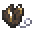
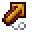
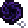

# Otherworldly Ornaments
Find **ornaments** stemming from **other worlds** that provide you with **unique buffs** and allow you to **travel to their dimension**

_This data pack was made for [Data Pack Jam 11](https://www.planetminecraft.com/jam/datapackjam11/) within a week_

---

## Obtaining an Ornament
Each ornament can be found in a **structure** in **it's respective dimension**.
All ornaments of dimensions you **can't** travel to by regular means, can also be found in the **overworld**.

## Ornaments
Ornaments activate their effect when **held in the offhand**.

If you **right click** with an active ornament, you **switch between it's dimension** and the **overworld**.

### Droughtstride
As you lose saturation, your speed increases but your jump height decreases.

### Alpgrow
As you scale mountains, you grow to their size. As you dive into the depths, you shrink.

### Quickscorch
Increase mining speed as you mine but your tool will start to burn your hands.

### Voidfall
Falling into the void shatters all your gear but you reappear high up in the sky unharmed.

## New Dimensions
Every ornament allows you to travel to it's dimension, for some ornaments, new dimensions are added

### Amplified
In this dimension the terrain is **amplified**, like the world generation type you can select when generating the world.
All biomes and structures are in the **same location** as they are in the overworld.

### Superflat
In this dimension, all surface blocks are at y=63 creating an almost perfectly **flat dimension**.
This causes **oceans** to be **dry land** and **mountains** to be a **stoney surface** with **floating aquifers**.
All biomes and structures are in the **same location** as they are in the overworld.

---

